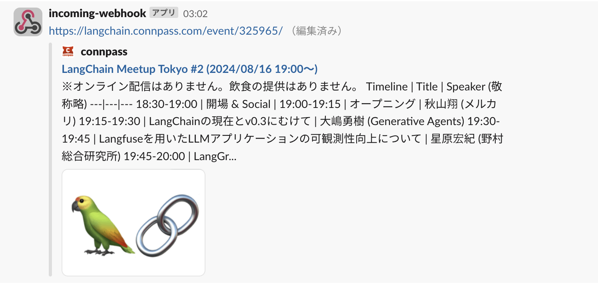
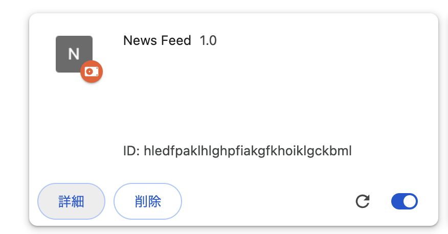
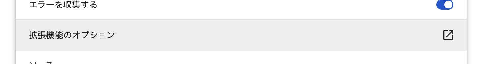
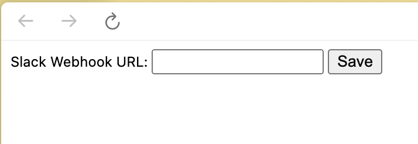

# chrome-website-notifications

Chromeの拡張機能で、現在開いているWebサイトのURLをSlackに通知します。



## 準備

#### 1. このリポジトリをクローンします

```shell
git clone git@github.com:totsukash/chrome-website-notification.git
```

#### 2. Chrome拡張機能を追加します

1. [Chrome拡張機能](chrome://extensions/)を開き、右上の`デベロッパーモード`を有効にします。
2. `パッケージ化されていない拡張機能を読み込む`をクリックし、クローンしたリポジトリのディレクトリ(
   chrome-website-notification/chrome )を選択します。

#### 3. SlackのWebhook URLを取得します

[Slack Incoming Webhooks](https://blueish.slack.com/apps/A0F7XDUAZ--incoming-webhook-?tab=more_info)から、指定のチャンネルのWebhook
URLを取得します。

#### 4. 拡張機能にWebhook URLを設定します

1. 拡張機能の`詳細`をクリックします
   
2. `拡張機能のオプション`をクリックします
   
3. SlackのWebhook URLを入力し、`Save`をクリックします
   

## 使い方

自分が今開いているWebサイト上でChromeの拡張機能をクリック → `Send URL to Slack`をクリックします。


## 注意

- 短い期間に2回同じURLをSlackに送信しても展開されません
